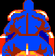

# star-rider-notes
Reverse engineering notes about the 1983 laserdisc arcade game, "Star Rider", compiled by SynaMax

Thanks to Matt O. for his work on reverse engineering the game so far.

You can check out his documentation here:
https://www.daphne-emu.com:9443/mediawiki/index.php/StarRiderMainCpu

His notes on the game's hardware and his disassemblies of the main program and PIF ROM have proven to be extremely helpful with these new findings.

Shout out to Sean Riddle as well for his very useful [Williams GFX Ripper](http://www.seanriddle.com/ripper.html) program, which allows me to view these sprites outside of the game (albeit with incorrect colors).  Star Rider uses 16-bit colors, whereas earlier Williams game use just 8-bit color palettes.

Special thanks to Joseba for his Star Rider emulator, it's allowed me to finally look at the game's RAM contents to map out the memory, as well as make some mods.  Thanks to my RE work on Sinistar and Joust, I recognized that Star Rider's game engine has a lot of similarities.  Just for fun, I changed the phrase for "I Grant You Another Life" with the Spanish translation.


----

## Image Page

There are several tables in the ROMs that organize the insane amount of sprites this game has.  The program uses a paging system to access all the different roms:

ROM|Address Range|Image Page Number
| --- | --- | --- |
U4|0x0000-0x3FFF|0
U19|0x4000-0x7FFF|0
U5|0x0000-0x3FFF|1
U20|0x4000-0x7FFF|1
U6|0x0000-0x3FFF|2
U21|0x4000-0x7FFF|2
U7|0x0000-0x3FFF|3
U22|0x4000-0x7FFF|3
U8|0x0000-0x3FFF|4
U23|0x4000-0x7FFF|4
U9|0x0000-0x3FFF|5
U24|0x4000-0x7FFF|5
U10|0x0000-0x3FFF|6
U25|0x4000-0x7FFF|6
U11|0x0000-0x3FFF|7
U26|0x4000-0x7FFF|7
U12|0x0000-0x3FFF|8
U27|0x4000-0x7FFF|8
U13|0x0000-0x3FFF|9
U46|0xC000-0xFFFF|N/A (text fonts and extra sprites)

----

## Sprite Definitions for first two image ROMs

Here's a table of sprite definitions for the first two image roms.  This table can be found at $1BC0 in ROM_34.U45.  $1BC0 equates to $9BC0 in RAM.

Table format is as follows (first Robofficial sprite used as reference):

Width|Height|Image Page 0|16-bit Address
| --- | --- | --- | --- |
12|24|00|002F 

```
ROBOFFICIAL sprite table 

12 24 00 00 2F 
12 20 00 02 B7 
12 20 00 04 F7 
12 20 00 07 37 
13 26 00 09 77 
18 30 00 0C 49 
18 30 00 10 C9 
18 30 00 15 49 
18 30 00 19 C9 
18 30 00 1E 49 

30 3A 00 22 C9 = SPEED / LOCATION HUD
30 3A 00 2D A9 = SCORE / POS. / BONUS HUD
1A 11 00 38 89 = PLAYER BIKE FRONT
1B 11 00 3A 43 
1C 11 00 3C 0E 
1C 11 00 3D EA 
1E 11 00 3F C6 
19 11 00 41 C4 
1A 11 00 43 6D 
1B 11 00 45 27 
1C 11 00 46 F2 
1C 11 00 48 CE 
1E 10 00 4A AA 
33 0C 00 4C 8A = 5 4 3 2 1 countdown lights
30 11 00 4E EE = COSMODROME
30 11 00 52 1E = CLIMAXONIA (unused?)
30 11 00 55 4E = METROPOLIA
30 11 00 58 7E = HEXAGONIA
30 11 00 5B AE = SPHERODONIA (unused?)
30 11 00 5E DE = STALACTIA
30 11 00 62 0E = MILKY WAY
30 11 00 65 3E = TITANIA
30 11 00 68 6E = CUBITANIA
30 11 00 6B 9E = CRYSTALIA
30 11 00 6E CE = FINISH
10 07 00 71 FE = BONUS_OFF
10 07 00 72 6E = BONUS_TURN
10 07 00 72 DE = BONUS_PASS
10 07 00 73 4E = BONUS_START
10 07 00 73 BE = BONUS_BLOCK
09 0D 00 74 2E = JOUST EASTER EGG
09 0D 00 74 A3 = JOUST EASTER EGG (2nd Frame)
13 28 00 75 18 = SINISTAR
81 01 00 78 3F = (I think this is the graph used for the Steering Switch Test in diagnostics)
```

With this table, we're able to reconstruct the source code to build the first two Image ROMs.  [Click this text to view the code!](starrider_image_0.asm)

### Joust and Sinistar Easter Eggs


This Joust Ostrich sprite shows up as an easter egg at the very end of Stalactia right before the finish line at the Comsodrome.


And this Sinistar sprite shows up in the middle of the Milky Way racetrack.  Both easter eggs pop up at the top left corner of the screen.

The picture above was taken with Sean Riddle's Williams GFX ripper but using the 8-bit color palette from Sinistar.  Star Rider uses 16-bit colors (RGB and Luma) and I made some fixes for Joseba's emulator that fixes the color palette to allow luma to work.  It's still not perfect (the colors appear to be more darker and bluer on real hardware) but this is waaaaay better than before.


----

## Biker images

There are several tables in the game code, but the largest one is located in ROM_31.U15 at address range $33CA-$3F7D that defines all the forward-facing biker sprites and what groups they belong to.

This table is very important as all the different biker sprites are stored in the image roms from largest to smallest, effectively scattering them across 17 separate eeproms. Following this table will help us figure out which positions and scaling (or level-of-detail) these bikers belong to.

The table also has the width and height for each sprite.  With the large biker sprites, it's pretty easy to figure out the image's dimensions without referring to this data, but as the sprite get smaller and smaller it gets extremely difficult to determine the true size of the sprite.  The smallest biker sprite I've found so far is 2 x 2 pixels!

The entire table has 39 "scale groups".  With the exception of the last group, there are 11 different rows or "positions" for each group.  The last group has 10 position entries instead.  Each row has 7 bytes.  

In the recreated source code, group numbers are hexadecimal.

Group $00 (duplicate table positions not shown):

BIKE_00_L2|BIKE_00_L1|BIKE_00_CP|BIKE_00_R1|BIKE_00_R2
| --- | --- | --- | --- | --- |
||||

Group $06 (duplicate table positions not shown):

BIKE_06_L2|BIKE_06_L1|BIKE_06_CP|BIKE_06_R1|BIKE_06_R2
| --- | --- | --- | --- | --- |
||||

### Groups $00-$25 (11 horizontal Biker positions)

A row for each group contains 7 bytes.  The table structure looks like this (Group 00 used as an example..."Biker Position" and "Biker Sprite Name" columns are for reference only):

16-bit address|Image Page|Width|Height|two Screen Position bytes?|Biker Position|Biker Sprite Name
| --- | --- | --- | --- | --- | --- | --- |
1287|01|36|57|44 5C |L5|BIKE_00_L2
1287|01|36|57|44 5C |L4|BIKE_00_L2
1287|01|36|57|44 5C |L3|BIKE_00_L2
1287|01|36|57|44 5C |L2|BIKE_00_L2
5745|01|32|54|3D 71 |L1|BIKE_00_L1
42D5|03|28|51|29 83 |Center|BIKE_00_CP
46DD|01|32|54|26 71 |R1|BIKE_00_R1
002D|01|36|57|27 5C |R2|BIKE_00_R2
002D|01|36|57|27 5C |R3|BIKE_00_R2
002D|01|36|57|27 5C |R4|BIKE_00_R2
002D|01|36|57|27 5C |R5|BIKE_00_R2

Note the duplicate entries in this table.  Multiple sprites are reused for different biker positions so there will be several duplicate images for many groups.

Biker positions are organized from left to right like this:


Row 1 |Row 2 |Row 3 |Row 4 |Row 5 |Row 6|Row 7 |Row 8 |Row 9 |Row 10 |Row 11
| --- | --- | --- | --- | --- | --- | --- | --- | --- | --- | --- |
L5|L4|L3|L2|L1|CP|R1|R2|R3|R4|R5

Row 6 will always be Center Position.

The smaller the number, the closer that bike is to Center so L1 is left-center, L2 is more towards the left, etc.

I believe that there are no groups that use 5 unique sprites for either direction, but it helps to think that both left and right directions can have 5 possible different sprites assigned.

For example, the first group contains the biker sprites that are closest to the player (with the bikers getting farther away from the player with each successive "scale group"). The first 20 groups appear to have their sprites organized like this:

Row 1 |Row 2 |Row 3 |Row 4 |Row 5 |Row 6|Row 7 |Row 8 |Row 9 |Row 10 |Row 11
| --- | --- | --- | --- | --- | --- | --- | --- | --- | --- | --- |
L2|L2|L2|L2|L1|CP|R1|R2|R2|R2|R2

To give these sprites a name, we'll follow a naming scheme:  BIKE_GroupNumber_Position

Scale groups 00 to 05 reuse the same BIKE_00_L2 and BIKE_00_R2 sprites for multiple rows/positions. 

### "VERT" Group (vertical Biker scaling)

There are 38 scale groups that use the left-to-right positions. The last group is different and is used for vertical sprites (when bikers are perpendicular to the player's point-of-view).  Instead of 11 rows for positioning from left-to-right, there are 10 rows that are used for scale levels (starting from closest to farthest).

16-bit address|Image Page|Width|Height|two Screen Position bytes?|Biker Sprite Name
| --- | --- | --- | --- | --- | --- |
2975|07|0E|4C|0D 18|BIKE_VERT_0
4161|07|0D|48|0C 17|BIKE_VERT_1
5BAF|07|0B|3D|0A 13|BIKE_VERT_2
7DD1|07|0A|31|08 0F|BIKE_VERT_3
2CF6|08|08|26|07 0C|BIKE_VERT_4
3F09|08|07|20|05 0A|BIKE_VERT_5
4883|08|06|1C|05 08|BIKE_VERT_6
53E9|08|05|16|03 06|BIKE_VERT_7
7F8F|05|04|0E|02 04|BIKE_VERT_8
5E27|08|02|03|00 00|BIKE_VERT_9


```
ROM_31.U15 ($33CA-$3F7D)

(16-bit address, IMAGE PAGE, Width, Height, Screen Position bytes?)

38 groups have 11 rows, but last group appears to have only 10 rows.

Biker positions go from left to right 

Rows: 0-3 = left, 4 = center left, 5 = center, 6 = center right, 7-A = right

12 87 01 36 57 44 5C 
12 87 01 36 57 44 5C 
12 87 01 36 57 44 5C 
12 87 01 36 57 44 5C 
57 45 01 32 54 3D 71 
42 D5 03 28 51 29 83 
46 DD 01 32 54 26 71 
00 2D 01 36 57 27 5C 
00 2D 01 36 57 27 5C 
00 2D 01 36 57 27 5C 
00 2D 01 36 57 27 5C 

12 87 01 36 57 44 5C 
12 87 01 36 57 44 5C 
12 87 01 36 57 44 5C 
12 87 01 36 57 44 5C 
57 45 01 32 54 3D 71 
54 FF 04 23 53 24 78 
46 DD 01 32 54 26 71 
00 2D 01 36 57 27 5C 
00 2D 01 36 57 27 5C 
00 2D 01 36 57 27 5C 
00 2D 01 36 57 27 5C 

12 87 01 36 57 44 5C 
12 87 01 36 57 44 5C 
12 87 01 36 57 44 5C 
12 87 01 36 57 44 5C 
57 45 01 32 54 3D 71 
74 B9 03 20 54 20 6F 
46 DD 01 32 54 26 71 
00 2D 01 36 57 27 5C 
00 2D 01 36 57 27 5C 
00 2D 01 36 57 27 5C 
00 2D 01 36 57 27 5C 

12 87 01 36 57 44 5C 
12 87 01 36 57 44 5C 
12 87 01 36 57 44 5C 
12 87 01 36 57 44 5C 
1F 43 02 2E 55 38 68 
2A 73 05 1D 55 1D 67 
0F FD 02 2E 55 22 68 
00 2D 01 36 57 27 5C 
00 2D 01 36 57 27 5C 
00 2D 01 36 57 27 5C 
00 2D 01 36 57 27 5C 

12 87 01 36 57 44 5C 
12 87 01 36 57 44 5C 
12 87 01 36 57 44 5C 
12 87 01 36 57 44 5C 
00 2D 03 2A 56 35 62 
77 0D 02 1A 56 1A 60 
68 F1 02 2A 56 1E 62 
00 2D 01 36 57 27 5C 
00 2D 01 36 57 27 5C 
00 2D 01 36 57 27 5C 
00 2D 01 36 57 27 5C 

12 87 01 36 57 44 5C 
12 87 01 36 57 44 5C 
12 87 01 36 57 44 5C 
12 87 01 36 57 44 5C 
35 EB 03 26 57 2F 5B 
30 89 06 17 54 17 59 
29 01 03 26 57 1B 5B 
00 2D 01 36 57 27 5C 
00 2D 01 36 57 27 5C 
00 2D 01 36 57 27 5C 
00 2D 01 36 57 27 5C 

35 DF 01 32 57 3E 57 
35 DF 01 32 57 3E 57 
35 DF 01 32 57 3E 57 
35 DF 01 32 57 3E 57 
18 C9 04 24 57 2C 56 
00 2D 06 19 56 19 55 
0C 8D 04 24 57 19 56 
24 E1 01 32 57 24 57 
24 E1 01 32 57 24 57 
24 E1 01 32 57 24 57 
24 E1 01 32 57 24 57 

00 2D 02 2E 58 39 52 
00 2D 02 2E 58 39 52 
00 2D 02 2E 58 39 52 
00 2D 02 2E 58 39 52 
00 2D 04 24 58 2F 52 
6C 34 05 1A 55 1A 4F 
68 59 03 24 58 17 52 
67 AD 01 2E 58 21 52 
67 AD 01 2E 58 21 52 
67 AD 01 2E 58 21 52 
67 AD 01 2E 58 21 52 

3D 7C 02 2B 59 35 4E 
3D 7C 02 2B 59 35 4E 
3D 7C 02 2B 59 35 4E 
3D 7C 02 2B 59 35 4E 
31 30 04 23 59 2E 4D 
74 D6 05 19 57 19 4C 
25 05 04 23 59 16 4D 
2E 89 02 2B 59 1F 4E 
2E 89 02 2B 59 1F 4E 
2E 89 02 2B 59 1F 4E 
2E 89 02 2B 59 1F 4E 

5A B0 02 29 59 32 49 
5A B0 02 29 59 32 49 
5A B0 02 29 59 32 49 
5A B0 02 29 59 32 49 
49 2D 04 22 59 2E 49 
77 08 04 1A 56 1A 43 
3D 5B 04 22 59 14 49 
4C 6F 02 29 59 1D 49 
4C 6F 02 29 59 1D 49 
4C 6F 02 29 59 1D 49 
4C 6F 02 29 59 1D 49 

1B A5 03 26 5A 2F 42 
1B A5 03 26 5A 2F 42 
1B A5 03 26 5A 2F 42 
1B A5 03 26 5A 2F 42 
6B B0 04 21 58 2C 43 
08 93 06 19 56 19 43 
60 58 04 21 58 13 43 
0E 49 03 26 5A 1C 42 
0E 49 03 26 5A 1C 42 
0E 49 03 26 5A 1C 42 
0E 49 03 26 5A 1C 42 

5B EB 03 25 56 2D 40 
5B EB 03 25 56 2D 40 
5B EB 03 25 56 2D 40 
5B EB 03 25 56 2D 40 
3D B0 05 1E 52 28 3F 
28 D9 06 18 52 18 41 
34 14 05 1E 52 12 3F 
4F 7D 03 25 56 1A 40 
4F 7D 03 25 56 1A 40 
4F 7D 03 25 56 1A 40 
4F 7D 03 25 56 1A 40 

0B 63 05 23 52 2B 3D 
0B 63 05 23 52 2B 3D 
0B 63 05 23 52 2B 3D 
0B 63 05 23 52 2B 3D 
50 CA 05 1E 51 28 3F 
46 85 06 17 4F 17 3F 
47 4C 05 1E 51 11 3F 
00 2D 05 23 52 19 3D 
00 2D 05 23 52 19 3D 
00 2D 05 23 52 19 3D 
00 2D 05 23 52 19 3D 

20 86 05 21 4D 28 3A 
20 86 05 21 4D 28 3A 
20 86 05 21 4D 28 3A 
20 86 05 21 4D 28 3A 
10 F9 06 1B 4C 24 3B 
74 3C 06 15 49 15 3B 
77 7D 01 1B 4C 11 3B 
16 99 05 21 4D 18 3A 
16 99 05 21 4D 18 3A 
16 99 05 21 4D 18 3A 
16 99 05 21 4D 18 3A 

63 3E 05 1F 4A 27 38 
63 3E 05 1F 4A 27 38 
63 3E 05 1F 4A 27 38 
63 3E 05 1F 4A 27 38 
54 8D 06 19 47 21 37 
00 2D 07 15 46 14 39 
4D 9E 06 19 47 0F 37 
5A 48 05 1F 4A 16 38 
5A 48 05 1F 4A 16 38 
5A 48 05 1F 4A 16 38 
5A 48 05 1F 4A 16 38 

20 EB 06 1D 46 24 36 
20 EB 06 1D 46 24 36 
20 EB 06 1D 46 24 36 
20 EB 06 1D 46 24 36 
61 C4 06 18 43 20 35 
15 BB 07 14 42 13 36 
5B 7C 06 18 43 0E 35 
18 FD 06 1D 46 15 36 
18 FD 06 1D 46 15 36 
18 FD 06 1D 46 15 36 
18 FD 06 1D 46 15 36 

3F 4D 06 1C 42 23 33 
3F 4D 06 1C 42 23 33 
3F 4D 06 1C 42 23 33 
3F 4D 06 1C 42 23 33 
05 EB 07 16 40 1D 33 
24 DB 07 13 3E 12 33 
7A 39 06 16 40 0D 33 
38 15 06 1C 42 14 33 
38 15 06 1C 42 14 33 
38 15 06 1C 42 14 33 
38 15 06 1C 42 14 33
 
6E 24 06 1A 3C 20 2F 
6E 24 06 1A 3C 20 2F 
6E 24 06 1A 3C 20 2F 
6E 24 06 1A 3C 20 2F 
1F DF 07 16 3A 1C 2F 
35 A7 07 12 39 11 30 
1A E3 07 16 3A 0D 2F 
68 0C 06 1A 3C 12 2F 
68 0C 06 1A 3C 12 2F 
68 0C 06 1A 3C 12 2F 
68 0C 06 1A 3C 12 2F 

10 93 07 18 37 1D 2C 
10 93 07 18 37 1D 2C 
10 93 07 18 37 1D 2C 
10 93 07 18 37 1D 2C 
3D 85 07 13 34 18 2A 
58 7F 07 10 33 0F 2B 
39 A9 07 13 34 0C 2A 
0B 6B 07 18 37 10 2C 
0B 6B 07 18 37 10 2C 
0B 6B 07 18 37 10 2C 
0B 6B 07 18 37 10 2C 

31 A2 07 15 31 19 27 
31 A2 07 15 31 19 27 
31 A2 07 15 31 19 27 
31 A2 07 15 31 19 27 
48 57 07 12 2F 16 27 
72 96 07 0E 2D 0D 27 
45 09 07 12 2F 0B 27 
2D 9D 07 15 31 0E 27 
2D 9D 07 15 31 0E 27 
2D 9D 07 15 31 0E 27 
2D 9D 07 15 31 0E 27 

4E E1 07 17 24 1C 23 
4E E1 07 17 24 1C 23 
66 04 07 12 24 15 23 
55 4E 07 13 2B 17 23 
6B 11 07 0F 2B 13 23 
06 58 08 0C 28 0B 23 
68 8C 07 0F 2B 09 23 
52 1D 07 13 2B 0D 23 
63 7C 07 12 24 0E 23 
4B A5 07 17 24 10 23 
4B A5 07 17 24 10 23 

70 16 07 14 20 18 1F 
70 16 07 14 20 18 1F 
04 58 08 10 20 12 1F 
60 E5 07 11 27 14 1F 
0D C4 08 0D 24 10 1E 
24 02 08 0A 22 0A 1E
0B F0 08 0D 24 07 1E 
5E 4E 07 11 27 0C 1F 
02 58 08 10 20 0D 1F 
6D 96 07 14 20 0E 1F 
6D 96 07 14 20 0E 1F 

75 0C 07 13 1E 17 1D 
75 0C 07 13 1E 17 1D 
11 69 08 0F 1F 11 1E 
00 2D 08 0F 25 13 1E 
14 DE 08 0C 23 0F 1D 
22 A2 08 0B 20 0B 1C 
13 3A 08 0C 23 07 1D 
7B A6 07 0F 25 0A 1E 
0F 98 08 0F 1F 0C 1E 
7D 55 05 13 1E 0D 1D 
7D 55 05 13 1E 0D 1D 

0A 14 08 11 1C 15 1B 
0A 14 08 11 1C 15 1B 
1B 4A 08 0E 1C 10 1B 
79 76 07 10 23 13 1D 
1E 52 08 0C 20 0F 1B 
30 7E 08 0A 1E 0A 1A 
1C D2 08 0C 20 07 1B 
77 46 07 10 23 0B 1D 
19 C2 08 0E 1C 0B 1B 
08 38 08 11 1C 0C 1B 
08 38 08 11 1C 0C 1B 

18 22 08 10 1A 14 19 
18 22 08 10 1A 14 19 
26 A8 08 0D 1A 0F 19 
29 44 08 0B 1E 0E 1A 
29 44 08 0B 1E 0E 1A 
3F E9 08 08 1C 08 19 
27 FA 08 0B 1E 06 1A 
27 FA 08 0B 1E 06 1A 
25 56 08 0D 1A 0A 19 
16 82 08 10 1A 0B 19 
16 82 08 10 1A 0B 19 

21 3A 08 0F 18 13 17 
21 3A 08 0F 18 13 17 
35 0E 08 0C 18 0D 17 
32 CC 08 0A 1D 0D 18 
32 CC 08 0A 1D 0D 18 
3A 52 08 09 1B 09 18 
31 AA 08 0A 1D 06 18 
31 AA 08 0A 1D 06 18 
33 EE 08 0C 18 0A 17 
1F D2 08 0F 18 0A 17 
1F D2 08 0F 18 0A 17 

2B C2 08 0E 16 11 15 
2B C2 08 0E 16 11 15 
3C 37 08 0B 16 0C 15 
39 4E 08 0A 1A 0C 17 
39 4E 08 0A 1A 0C 17 
4A 7B 08 07 18 07 15 
38 4A 08 0A 1A 05 17 
38 4A 08 0A 1A 05 17 
3B 45 08 0B 16 09 15 
2A 8E 08 0E 16 0A 15 
2A 8E 08 0E 16 0A 15 

2B C2 08 0E 16 11 15 
2B C2 08 0E 16 11 15 
3C 37 08 0B 16 0C 15 
47 C3 08 08 18 0B 15 
47 C3 08 08 18 0B 15 
4C 67 08 07 17 07 14 
46 43 08 08 18 04 15 
46 43 08 08 18 04 15 
3B 45 08 0B 16 09 15 
2A 8E 08 0E 16 0A 15 
2A 8E 08 0E 16 0A 15 

2F 52 08 0F 14 11 13 
3E 19 08 0C 14 0F 13 
43 2F 08 0A 14 0B 13 
41 98 08 09 17 0B 14 
41 98 08 09 17 0B 14 
4F 7C 08 07 15 07 13 
40 C9 08 09 17 05 14
40 C9 08 09 17 05 14 
42 67 08 0A 14 08 13 
3D 29 08 0C 14 08 13 
2E 26 08 0F 14 0C 13 

37 3C 08 0F 12 0F 11 
44 BD 08 0B 12 0D 11 
4B C5 08 09 12 0A 11
49 D3 08 08 15 09 12 
49 D3 08 08 15 09 12 
52 97 08 06 13 05 11 
49 2B 08 08 15 04 12 
49 2B 08 08 15 04 12 
4B 23 08 09 12 07 11 
43 F7 08 0B 12 07 11 
36 2E 08 0F 12 0C 11 

47 03 08 0C 10 0E 0F 
4D A8 08 0A 10 0C 0F 
51 1B 08 08 10 09 0F 
50 0F 08 07 14 09 11 
50 0F 08 07 14 09 11 
56 07 08 06 11 05 0F 
7F 39 03 07 14 03 11 
7F 39 03 07 14 03 11 
50 9B 08 08 10 06 0F 
4D 08 08 0A 10 06 0F 
45 83 08 0C 10 09 0F 

4E E2 08 0B 0E 0C 0D 
52 19 08 09 0E 0B 0D 
53 79 08 08 0E 08 0D 
55 9B 08 06 12 06 0F 
55 9B 08 06 12 06 0F 
59 35 08 05 0F 04 0D 
54 C3 08 06 12 03 0F 
54 C3 08 06 12 03 0F 
53 09 08 08 0E 05 0D 
51 9B 08 09 0E 05 0D 
4E 48 08 0B 0E 09 0D
 
55 2F 08 09 0C 09 0B 
57 2D 08 08 0C 08 0B 
59 80 08 06 0C 05 0B 
57 8D 08 06 10 06 0D 
57 8D 08 06 10 06 0D 
5A 54 08 04 0D 03 0C 
56 CD 08 06 10 03 0D 
56 CD 08 06 10 03 0D 
7F 81 01 06 0C 05 0B 
56 6D 08 08 0C 05 0B 
54 57 08 09 0C 07 0B 

58 E5 08 08 0A 08 09 
5A 0E 08 07 0A 07 09 
5A BA 08 05 0A 04 09 
58 41 08 06 0E 06 0C 
58 41 08 06 0E 06 0C 
5B AC 08 04 0C 03 0B 
57 ED 08 06 0E 03 0C 
57 ED 08 06 0E 03 0C 
5A 88 08 05 0A 04 09 
59 C8 08 07 0A 04 09 
58 95 08 08 0A 06 09 

5B 4C 08 06 08 06 07 
5C 80 08 05 08 05 07 
5C F0 08 04 08 03 07 
5B 7C 08 04 0C 05 0A 
5B 7C 08 04 0C 05 0A 
5D 4C 08 04 09 02 08 
5B 1C 08 04 0C 02 0A 
5B 1C 08 04 0C 02 0A 
5C D0 08 04 08 03 07 
5C 30 08 05 08 02 07 
5A EC 08 06 08 04 07 

5C 06 08 06 07 05 06 
5D 88 08 04 06 03 05 
5D F1 08 03 06 02 05 
5C A8 08 04 0A 03 08 
5C A8 08 04 0A 03 08 
5D CA 08 03 07 01 06 
5C 58 08 04 0A 02 08 
5C 58 08 04 0A 02 08 
5D DF 08 03 06 02 05 
5D 70 08 04 06 03 05 
5B DC 08 06 07 05 06 

5D 2E 08 05 06 04 05 
5D 88 08 04 06 03 05 
5D F1 08 03 06 02 05 
5D B5 08 03 07 02 05 
5D B5 08 03 07 02 05 
5E 03 08 03 06 01 05 
5D A0 08 03 07 02 05 
5D A0 08 03 07 02 05 
5D DF 08 03 06 02 05 
5D 70 08 04 06 03 05 
5D 10 08 05 06 03 05 

5E 1E 08 03 03 02 02 
5E 33 08 02 03 02 02 
5E 39 08 02 03 01 02 
7F BB 07 02 06 01 04 
7F BB 07 02 06 01 04 
5E 3F 08 02 03 00 02 
7F B9 06 02 06 01 03 
7F B9 06 02 06 01 03 
5E 2D 08 02 03 01 02 
7F C5 03 02 02 02 01 
5E 15 08 03 03 02 02 

29 75 07 0E 4C 0D 18 
41 61 07 0D 48 0C 17 
5B AF 07 0B 3D 0A 13 
7D D1 07 0A 31 08 0F 
2C F6 08 08 26 07 0C 
3F 09 08 07 20 05 0A 
48 83 08 06 1C 05 08 
53 E9 08 05 16 03 06 
7F 8F 05 04 0E 02 04 
5E 27 08 02 03 00 00
```
----

## Rear-view sprite tables

Third sprite table found in ROM_31.U15 ($118E-$13BD) used for rear-view mirror

20 groups use left-to-right positioning with three rows: 1 = Left (Right-side of rear view), 2 = Center, 3 = Right (Left-side of rear view)

One "VERT" group with 14 rows instead of 10?


```
00 2D 09 10 22 13 1D 
65 9F 08 12 20 11 3F 
5E 45 08 10 22 0C 1D

00 2D 09 10 22 13 1D 
67 DF 08 10 20 0E 37 
5E 45 08 10 22 0C 1D

00 2D 09 10 22 13 1D 
69 DF 08 0E 22 0D 32 
5E 45 08 10 22 0C 1D

00 2D 09 10 22 13 1D 
6B BB 08 10 22 0F 2D 
5E 45 08 10 22 0C 1D

00 2D 09 10 22 13 1D 
6D DB 08 10 22 0F 29 
5E 45 08 10 22 0C 1D

00 2D 09 10 22 13 1D 
6F FB 08 0E 24 0D 27 
5E 45 08 10 22 0C 1D

00 2D 09 10 22 13 1D 
71 F3 08 0D 24 0C 24 
5E 45 08 10 22 0C 1D

00 2D 09 10 22 13 1D 
73 C7 08 0C 24 0C 21 
5E 45 08 10 22 0C 1D

00 2D 09 10 22 13 1D 
75 77 08 0C 26 0B 20 
5E 45 08 10 22 0C 1D

00 2D 09 10 22 13 1D 
77 3F 08 0B 22 0A 1D 
5E 45 08 10 22 0C 1D

02 4D 09 0E 1E 0F 1A 
78 B5 08 0A 1E 09 1A 
60 65 08 0E 1E 0A 1A

03 F1 09 0D 1A 0E 16 
79 E1 08 08 1A 07 16 
62 09 08 0C 1A 09 16

05 43 09 0B 16 0C 13 
7A B1 08 07 16 06 13 
63 41 08 0B 16 07 13

06 35 09 09 12 0A 10 
7B 4B 08 06 12 05 10 
64 33 08 09 12 06 10

06 D7 09 07 0E 07 0C 
7B B7 08 05 0E 04 0C 
64 D5 08 07 0E 05 0C

07 39 09 05 0A 04 09 
7B FD 08 04 0A 02 09 
65 37 08 05 09 03 08

07 6B 09 04 08 04 07 
7C 25 08 03 08 01 07 
65 64 08 04 08 03 07

07 8B 09 03 06 02 05 
7C 3D 08 02 05 00 04 
65 84 08 03 06 02 05

07 9D 09 02 04 01 03 
7C 47 08 02 03 00 02 
65 96 08 02 04 01 03

07 A5 09 01 01 00 00 
7C 4D 08 01 02 00 01 
65 9E 08 01 01 00 00
 
07 A6 09 0A 37 09 24 
09 CC 09 0A 34 09 22 
0B D4 09 09 30 08 1F 
0D 84 09 08 2C 07 1C 
0E E4 09 07 28 06 1A 
0F FC 09 07 24 06 17 
10 F8 09 06 20 05 14 
11 B8 09 06 1C 04 12 
12 60 09 05 18 03 0F 
12 D8 09 05 14 03 0C 
13 3C 09 04 10 02 0A 
13 7C 09 03 0C 01 07 
13 A0 09 03 08 01 04 
13 B8 09 01 03 00 01

Rear view flames:
16 38 09 0D 0A 0C 09 = Center
16 BA 09 0D 0A 0B 09

18 54 09 0E 0A 0F 09 = Right (Left-view)
18 E0 09 0E 0A 0E 09

17 3C 09 0E 0A 08 09 = Left (Right-view)
17 C8 09 0E 0A 0C 09 
```

Another sprite table is separate from this one and is responsible for animating the rear-view of the player's bike jet exhaust and tail fin.  It's found in ROM_34.U45 at address $1532.

There's another jet exhaust sprite at $13FC that has no flames, it's quite possible that this is unused since it is not included in this table.

```
14 80 09 0D 0B 0C 0A 
15 0F 09 0D 0B 0C 0A 
14 80 09 0D 0B 0C 0A 
15 9E 09 0E 0B 0D 0A
```

## U13 (Image Page 9) sprite definitions for Explosion particles

Yet another sprite table found in ROM_34.U45 at address $18E2, this is used for the explosion particle effects found in in ROM_19.U13 (Image Page 9).  Each sprite is defined in 6 bytes.  A fireball sprite at $2062 seems to be unused.

The biker explosion particle effects are split up into two different types: a "fireball" animation and a jagged "shrapnel" animation (it could also be a "spark").

Even though they are referenced in ROM_34.U45 at address $18E2, the shrapnel sprites at $196C-$2148 don't appear in normal gameplay.

They do show up in rare early footage for Star Rider and as seen in the video, the sprites color-cycle to "flip-flop" between frames.

https://www.youtube.com/watch?v=s2ZSCQockuU&t=903s

https://www.youtube.com/watch?v=s2ZSCQockuU&t=859s

https://www.youtube.com/watch?v=s2ZSCQockuU&t=886s

The animation of the fireball sprites are different as well.  In the final game, they start falling down as they get smaller, but in this footage they just expand and fly to the top and upper-sides of the screen before disappearing.

```
1F 9C 0B 12 0A 08 
1E 94 0C 16 0B 0A 
1D B8 0B 14 0A 09 
1C DC 0B 14 0A 09 
1C D8 02 02 01 00 
1C C6 03 06 02 02 
1C A6 04 08 03 03 
1C 74 05 0A 04 04 
1C 38 05 0C 04 05 
1B E4 06 0E 05 06 
1B 82 07 0E 06 06 
1A F2 08 12 07 08 
1A 3E 09 14 08 09 
19 6C 0A 15 09 0A 
2B F5 02 02 01 00 
2B F9 02 02 01 00 
2B FD 02 02 01 00 
2B F9 02 02 01 00 
2C 01 03 04 02 01 
2C 0D 04 06 03 02 
2C 25 03 04 02 01 
2C 0D 04 06 03 02 
2C 31 04 07 03 03 
2C 4D 05 08 04 03 
2C 75 04 08 03 03 
2C 4D 05 08 04 03 
2C 95 06 0B 05 05 
2C D7 07 0B 06 05 
2D 24 06 0C 05 05 
2C D7 07 0B 06 05 
2D 6C 08 0F 07 07 
2D E4 09 10 08 07 
2E 74 09 0F 08 07 
2D E4 09 10 08 07 
2E FB 0B 15 0A 0A 
2F E2 0B 14 0A 09 
30 BE 0B 16 0A 0A 
2F E2 0B 14 0A 09 
31 B0 0E 1C 0D 0D 
33 38 0F 1C 0E 0D 
34 DC 0E 1C 0D 0D 
33 38 0F 1C 0E 0D 
36 64 11 22 10 10 
38 A6 12 24 11 11 
3B 2E 11 21 10 10 
38 A6 12 24 11 11 
21 49 15 29 14 14 
24 A6 16 2C 15 15 
28 6E 15 2B 14 15 
24 A6 16 2C 15 15
```

## Track start frame table

Thanks to Joseba Epalza for figuring out the laserdisk frame numbers for the start of the racetracks.

These numbers can be found at address $3DBA in rom_32.u26.  Curiously, all the racetrack frame numbers end in 9.

Frame # (Hex)|Frame # (Decimal)|Marker
| --- | --- | --- |
0003|3|Start of laserdisc test card
0044|68|Attract mode start
0EFF|3839|Cosmodrome start
0F63|3939|Cubitania
1FA3|8099|Hexagonia
2FE3|12559|Crystalia
3E2F|15919|Milky Way
4CAD|19629|Titania
5B2B|23339|Stalactia
6B6B|27499|Metropolia

Another table can be found in the same rom file at address $65B.  This one appears to have the start and finish frames for game logic.  

A pattern also emerges as each race track uses three frame markers.  The first one is for the start of the race, the second is used when the player crosses the finish line and the last marker is used to pause the footage after the bikers roll through the Cosmodrome, right before the game cues up the countdown for the next race.  Once the countdown is done, we move on to the starting frame for the next racetrack (note the third frame and the first frame for the next track share the same value).

Again, we can see how the start of every race begins with a frame number ending in 9, but now we can also see every race finish occurs on a frame ending in 1:

Frame # (Hex)|Frame # (Decimal)|Marker
| --- | --- | --- |
0F63|3939|Cubitania (Start)
1EDD|7901|Cubitania (Race Finish, continue playing video)
1FA3|8099|Cosmodrome arrival (Pause video here for countdown)
1FA3|8099|Hexagonia (Start)
2F1D|12061|Hexagonia (Finish)
2FE3|12559|Cosmodrome arrival (Pause)
2FE3|12559|Crystalia (Start)
3D69|15721|Crystalia (Finish)
3E2F|15919|Cosmodrome arrival (Pause)
3E2F|15919|Milky Way (Start)
4BE7|19431|Milky Way (Finish)
4CAD|19629|Cosmodrome arrival (Pause)
4CAD|19629|Titania (Start)
5A65|23141|Titania (Finish)
5B2B|23339|Cosmodrome arrival (Pause)
5B2B|23339|Stalactia (Start)
6AA5|27301|Stalactia (Finish)
6B6B|27499|Cosmodrome arrival (Pause)
6B6B|27499|Metropolia (Start)
7AE5|31461|Metropolia (Finish)
7BAB|31659|Last Cosmodrome departure (Pause)

## RAM Memory Map

Address|Description|Size
| --- | --- | --- |
$A035 | Frame marker #1 (Race Start) | 2
$A037 | Frame marker #2 (Race Finish) | 2
$A039 | Frame marker #3 (Cosmodrome arrival) | 2
||
$A102 | ??? (Always $F195) | 2
$A104 | Something explosion related | 1
$A105 | ??? (1 = race start, 3 = high score after race) | 1
$A106 | 16-bit Steering position (also player start too??) (F000 = Center, C000 = Left, E000 = Right) | 2
$A108 | ??? (Always $C000) | 2
$A10A | Throttle (F0 = Center, C0 = Stop, F8 = Full Throttle, B0 = Turbo, B8 = Turbo/Full, 80 = Turbo/Stop) | 1
$A10B | Throttle (fractional byte; left nibble is stop, right nibble is full) | 1
$A10C | ??? (Always $30) | 1
$A10D | ??? (left nibble flashes when pulling on throttle) | 1
$A10E | Gameplay or High Score flag (4 = intro "Get Ready", 2 = racing, 0A = High Score Entry) | 1
$A10F | 16-bit Gameplay Time? (Counts up during gameplay) | 2
$A111 | Gameplay Timer Enable Flag? (0 = Attract mode or High Score Entry) | 1
||
$A115 | Coin Slot Bit Mask (08, 10, 20) | 1
||
$A1CB | Current Score (HIGH 4 BCD digits) | 2
$A1CD | Current Score (LOW 4 BCD digits) | 2
$A1CF | Current High Score (HIGH 4 BCD digits) (saves at every finish-line) | 2
$A1D1 | Current High Score (LOW 4 BCD digits) (saves at every finish-line) | 2
$A1D3 | ??? (Mentioned but doesn't do anything) | 2
$A1D5 | Control Panel Enable or Race Active Flag? (On during race) | 1
$A1D6 | Player Speed (4 BCD digits) | 2
$A1D8 | Current Player Race Position (1 = 1st Place, 5 = Last Place) | 1
$A1D9 | Overtake flag? (value = 2 when driving pass biker) | 1
$A1DA | Bonus Points (3 BCD digits) | 3
$A1DD | ??? (probably padding) | 1
$A1DE | "Checkered Flag" (Enabled on race finish, off when Robo appears) | 1
$A1DF | Collision ID? | 1
$A1E0 | Collision pointer? (always "$AFB5") | 2
||
$A1E5 | Final Player Race Position (Off during race, 5 = game over) | 1
$A1E6 | Number of Bikers at Finishline (counts up as bikers cross finish; 4 = game over) | 1 
||
$A1E9 | Current Race Number | 2
$A1EA | Number of Races Won | 1
||
$A1ED | Mentioned in Robo routine, but doesn't do anything | 1
$A1EE | "I grant you another life" Active Flag | 1
$A1EF | "I grant you another life" Don't Repeat Flag | 1
||
$A1F0 | Something Robofficial related | 2
$A1F2 | ??? | 1
$A1F3 | ??? | 1
$A1F4 | Current Robofficial Phrase Text Starting X-Position? | 1
$A1F5 | Current Robofficial Phrase Test Pointer | 2
||
$A217 | Sound ID Array #1 (1st byte = flag, 2nd byte = sound ID) | 2
$A218 | (Either 02, 09, 0A)
$A219 | Sound ID Array #2 (1st byte = flag, 2nd byte = sound ID) | 2
$A21A | (Robofficial sounds 0C, 0D, 0E, 0F)
$A21B | Sound ID Array #3 (1st byte = flag, 2nd byte = sound ID) | 2
$A21D | Sound ID Array #4 (1st byte = flag, 2nd byte = sound ID) | 2


## Sound IDs

There are two sets of sound IDs that can be seen at address $C982.  The first set is used exclusively for playing back sounds during diagnostics and the second set of sounds IDs are used during gameplay.

### Sound Test IDs

The sound descriptions (and which "sound line" number they belong to) are from the Star Rider manual.

* 1 = FE (rising swept-tone)
* 2 = FD (typewriter)
* 3 = FB (high-pitched ping)
* 4 = F7 (carriage return)
* 5 = EF (crash or explosion)
* 6 = DF (high-pitched peep)
* 7 = BF (turbo whoosh)
* 8 = 7F (coin sound: siren)

### Gameplay Sound IDs

* 01 = Silence?
* 02 = Explosion
* 17 = Coin sound
* 0E = whoosh?
* 0C = typerwriter
* 0D = Robofficial ding
* 09 = Robofficial fade out?

Here is the code that triggers the high score revving sound.

```
4238: 34 06           PSHS      D
423A: BD 40 9B        JSR       $409B
423D: 86 3C           LDA       #$3C
423F: B7 A2 13        STA       $A213
4242: CC 01 0A        LDD       #$010A          ; 0A is our high score sfx (maybe 01 is a flag for playback or priority?)
4245: FD A2 17        STD       $A217           ; store the sound ID in the sound array
4248: 35 86           PULS      PC,D            ; restore PC and D (return to previous routine)
```
The $010A is some sort of flag and the sound ID.  The 0A is what gets sent to the sound board, while the 01 is cleared immediately after it's written to $A217 (probably to denote that the sound is playing).

$4081 has the pointers to the sound effects array.  

```
$A222 | ???
$A215 | Sound enable?
$A224 | Sound ID Array #3
$A217 | Explosion, High Score Revving
$A219 | Robofficial sounds
$A21D
$A225
$A21F | Race finish dings
$A227
$A22C
$A22A
$A22F
$A232
```
